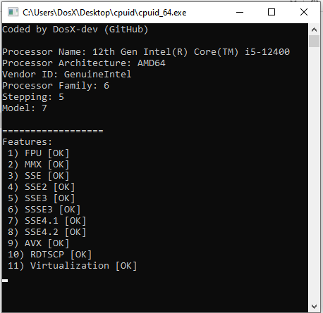

# ```cpuid``` using example
An example of identifying a processor through the "cpuid" instruction (is used to retrieve information about the processor, including details about its architecture, vendor, features etc)

### [https://github.com/DosX-dev/cpuid-in-C/releases/tag/Builds](Download compiled as .EXE)

